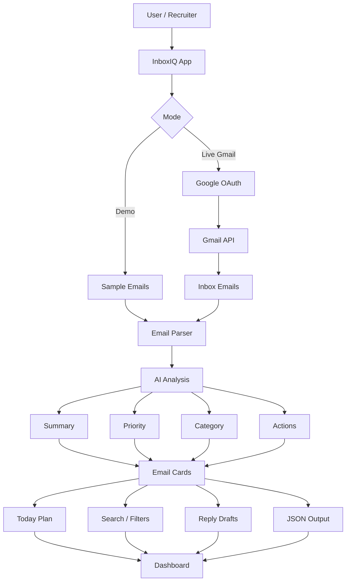

# InboxIQ

**Live Demo:** https://inboxiq-8egt.onrender.com

InboxIQ is an AI-powered email productivity assistant that converts messy inbox messages into structured tasks, priorities, scheduling needs, follow-ups, suggested replies, reasons, and a **Today’s Action Plan**.

## Problem

Important emails are buried in messy inboxes, making it easy to miss deadlines, follow-ups, and meeting updates.

## Solution

InboxIQ does more than summarize email. It turns messages into **structured action cards** and a **dashboard-level Today’s Action Plan** that users can quickly review or copy—so priorities, follow-ups, and scheduling needs are easy to act on.

## System Design

InboxIQ is an **AI-powered email intelligence platform** for turning noisy inboxes into structured action cards, a **Today’s Action Plan**, and recruiter-friendly dashboard views. It ships with a **safe demo experience**, an embedded Gmail walkthrough video, and an OAuth-ready **live Gmail** path (readonly scope, approved test users during testing).

### 1. System Design Overview

At a high level, InboxIQ is a **Flask web application** with a browser-based UI. Users choose **demo** (sample emails) or **live Gmail** (OAuth-ready, approved test users during testing). Both modes share one pipeline that produces structured cards, metrics, **Today’s Action Plan**, search/filters, suggested replies, and JSON output. OpenAI improves extraction when configured; a **heuristic fallback** keeps demos reliable without an API key.

### 2. Architecture Diagram

End-to-end flow from a recruiter or user through the UI, data sources, processing, and dashboard:



InboxIQ supports two paths: a safe **demo mode** and a **live Gmail mode**. Both paths use the same processing pipeline. Emails are parsed, analyzed, categorized, prioritized, and transformed into structured cards. The dashboard then shows a **Today’s Action Plan**, search and filters, suggested replies, and JSON output.

### 3. How the AI Email Analysis Flow Works

1. **Input** — Demo emails from the sample dataset, or Gmail emails after OAuth (readonly scope).
2. **Normalization** — Clean subject, body, and sender data using the same pipeline for demo and live.
3. **Analysis** — Generate summary, priority, category, deadline, scheduling need, suggested reply, and reason for each message.
4. **Aggregation** — Compute dashboard metrics and build **Today’s Action Plan** from all analyzed emails.
5. **Presentation** — Render structured cards with **search**, **category/priority filters**, **Copy Action Plan**, suggested-reply copy buttons, and JSON output (`/api/analyze`, `/api/live-analyze`).

This pipeline is intentionally **server-side**: sensitive processing and API keys stay on the server; the browser receives HTML and JSON appropriate for the public demo.

### 4. Key Components

- **Web Interface:** Demo dashboard, live Gmail flow, embedded walkthrough video, and recruiter splash.
- **Gmail API Integration:** Read-only inbox access after user consent (OAuth-ready; limited to approved test users during testing).
- **Email Processing Layer:** Parses and normalizes email content before analysis.
- **AI Analysis Engine:** Summary, priority, category, deadlines, scheduling needs, suggested replies, and reasons.
- **Dashboard Output:** Email cards, Today’s Action Plan, search/filters, copy buttons, and JSON view.

### 5. Demo Mode vs Live Gmail Mode

**Demo Mode:**

- Always available on the live demo and locally.
- Uses sample email data.
- Useful for recruiters and reviewers.
- Does not require Gmail login.

**Live Gmail Mode:**

- Uses Google OAuth and the Gmail API.
- Limited to **approved test users** during OAuth testing/verification (not production-verified yet).
- **Read-only** inbox access after user permission.
- Real Gmail flow is also shown through the **embedded walkthrough video** on the demo dashboard.

### 6. Why This Design Matters

- **Trust and clarity** — Separating **demo** from **live Gmail** lets recruiters and hiring managers try the product **without** handing over inbox access, while still showing a credible path to production use.
- **One pipeline, two front doors** — A single processing path reduces bugs and keeps **demo behavior aligned** with live behavior.
- **API-first angles** — JSON endpoints support **portfolio reviews** and lightweight integrations without forcing a particular client.
- **Pragmatic AI** — Optional OpenAI with a **fallback** demonstrates judgment about cost, outages, and environments where keys are not available.
- **Security-minded Gmail use** — **Read-only** scope and OAuth are appropriate for an analysis tool that summarizes and categorizes rather than sending mail on the user’s behalf (sending could be a later enhancement).

This system design shows that InboxIQ is not just a static AI demo. It is structured like a real product with a frontend interface, authentication flow, external API integration, backend processing, and AI-powered analysis. The design makes the platform easy to demo while still supporting real Gmail inbox functionality.

## Current MVP Features

- **Demo mode** with sample inbox emails (recruiter-safe, always available)
- **Live Gmail OAuth-ready mode** (readonly scope; approved test users during OAuth testing)
- **Embedded live Gmail walkthrough video** on the demo dashboard
- **Today’s Action Plan** — dashboard-level summary of all analyzed emails
- **Copy Action Plan** button
- **Search inbox** across sender, subject, preview, structured fields, and replies
- **Category filters** (Action Needed, Schedule, Follow-up, FYI, Urgent)
- **Priority filters** (High, Medium, Low)
- **Structured email cards** with task summary, deadline, and scheduling need
- **Suggested reply drafts** with copy button
- **Reason/explanation** for each classification
- **JSON output view** — `/api/analyze` (demo), `/api/live-analyze` (live Gmail)
- **Recruiter-safe privacy/OAuth note** on the splash screen (demo access without Gmail login)

## Tech Stack

- Python
- Flask
- OpenAI API (optional with offline heuristic fallback)
- Gmail API + OAuth (optional live mode)
- HTML/CSS/JavaScript dashboard

## How to Run Locally

1. Install dependencies:

   ```bash
   python3 -m pip install -r requirements.txt
   ```

2. Create a `.env` file from `.env.example` and set your OpenAI API key:

   ```bash
   cp .env.example .env
   ```

   Edit `.env` and assign your real key to `OPENAI_API_KEY`.

3. Start the app:

   ```bash
   python3 app.py
   ```

   Open the **demo** dashboard at [http://127.0.0.1:5000/](http://127.0.0.1:5000/). Demo JSON: [http://127.0.0.1:5000/api/analyze](http://127.0.0.1:5000/api/analyze).

## Live Gmail Sync Setup

Optional flow for analyzing real inbox threads (readonly Gmail scope):

1. Go to [Google Cloud Console](https://console.cloud.google.com/) and select or create a project.
2. Enable **Gmail API** for that project.
3. Configure the **OAuth consent screen** (External or Internal as appropriate for your account).
4. Under **Credentials**, create an **OAuth client ID** of type **Desktop app**.
5. Download the OAuth client JSON file from the Console.
6. Rename it to `credentials.json`.
7. Place `credentials.json` in the **project root** next to `app.py` (same folder as this README).
8. Run `python3 app.py`.
9. Visit [http://127.0.0.1:5000/connect-gmail](http://127.0.0.1:5000/connect-gmail) and complete the browser sign-in flow.
10. After authorization, `token.json` is written locally (access + refresh tokens for your user — treat as secret).
11. Open **Live Inbox** at [http://127.0.0.1:5000/live-inbox](http://127.0.0.1:5000/live-inbox). Live JSON: [http://127.0.0.1:5000/api/live-analyze](http://127.0.0.1:5000/api/live-analyze).

**Do not commit `credentials.json` or `token.json`.** They are listed in `.gitignore`.

## Future Improvements

- Calendar integration
- Save tasks to a database
- Daily/weekly digest
- More advanced priority scoring
- Export to Google Tasks, Notion, or Trello
- Optional one-click draft creation (not automatic sending)

## Security Note

- **Do not commit `.env`** — contains secrets such as your OpenAI API key.
- **Do not commit `credentials.json` or `token.json`** — Gmail OAuth client secrets and user tokens.
- Gmail access uses a **read-only** scope for inbox analysis.
- **Demo mode** uses sample data only; no private inbox access required for recruiter review.
- Keep `.env` local and use `.env.example` only as a template without real credentials.
