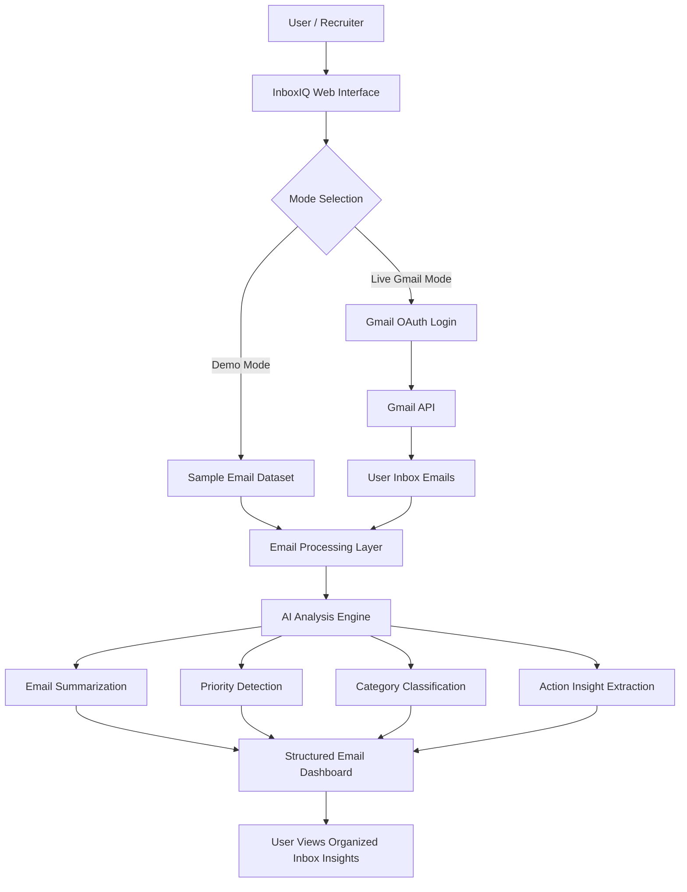

# InboxIQ

**Live Demo:** https://inboxiq-8egt.onrender.com

InboxIQ is an AI-powered inbox assistant that converts unstructured emails into structured tasks, deadlines, priorities, scheduling needs, and suggested replies.

## Problem

Important emails are buried in messy inboxes, making it easy to miss deadlines, follow-ups, and meeting updates.

## Solution

InboxIQ analyzes unstructured email content and turns it into structured action cards so you can see what matters at a glance.

## System Design

InboxIQ is built as an **AI-powered email intelligence platform**: it helps users and teams make sense of noisy inboxes by summarizing messages, surfacing what is urgent, grouping content by category, and presenting everything in a **structured dashboard** aimed at productivity. It ships with a **safe demo experience** and an optional **live Gmail** path backed by the official **Gmail API** and Google OAuth.

### 1. System Design Overview

At a high level, InboxIQ is a **Flask web application** with a browser-based UI. Users choose whether they are looking at **curated sample emails** (demo) or **their own inbox** (live Gmail). In both cases, the same **email processing and analysis pipeline** turns raw message text into **structured insights**—summaries, priorities, categories, deadlines, scheduling cues, and suggested replies—then renders them as **action cards** you can scan, search, and filter. Optionally, an **OpenAI-powered** model improves extraction quality; if no API key is configured, a **heuristic fallback** still produces useful structure so demos stay reliable.

### 2. Architecture Diagram

End-to-end flow from a recruiter or user through the UI, data sources, processing, and dashboard:



InboxIQ is designed around a simple but scalable email intelligence flow. The user first enters the web interface and chooses between demo access or live Gmail access. Demo mode uses sample email data so recruiters can test the platform quickly without connecting an account. Live Gmail mode uses Google OAuth and the Gmail API to securely retrieve real inbox messages after user permission.

Once email data is available, the processing layer prepares the messages for analysis. The AI analysis engine then summarizes email content, detects priority, classifies messages into useful categories, and extracts action-oriented insights. The final results are displayed in a structured dashboard so users can understand their inbox faster and focus on the most important messages.

### 3. How the AI Email Analysis Flow Works

1. **Input** — The app receives one or more email records (sender, subject, and body text), either from the **built-in sample dataset** or from **Gmail** after OAuth.
2. **Normalization** — Message text is prepared for analysis (same code path for demo and live so behavior stays comparable).
3. **Analysis** — The **AI analysis engine** enriches each message: concise **summary**, **priority** signal, **category**, key **actions** (tasks, deadlines, meetings), and when configured, **suggested replies**.
4. **Aggregation** — Results are combined with **lightweight statistics** (for example, counts by category or priority) to seed the dashboard.
5. **Presentation** — The **web interface** renders **structured cards**, with client-side **search and filters**, plus optional **JSON APIs** for integrations or demos (`/api/analyze` for demo data, `/api/live-analyze` for live Gmail).

This pipeline is intentionally **server-side**: sensitive processing and API keys stay on the server; the browser receives HTML and JSON appropriate for the public demo.

### 4. Key Components

- **Web Interface:** Provides the main dashboard, demo access, and live Gmail connection flow.
- **Gmail API Integration:** Allows InboxIQ to read inbox messages only after the user grants permission.
- **Email Processing Layer:** Cleans and organizes email content before sending it for AI analysis.
- **AI Analysis Engine:** Generates summaries, detects priority, classifies messages, and extracts useful insights.
- **Dashboard Output:** Presents the analyzed emails in a clean, structured, recruiter-friendly interface.

### 5. Demo Mode vs Live Gmail Mode

**Demo Mode:**

- Lets recruiters test the product immediately.
- Uses prepared email examples.
- Does not require Gmail login.
- Useful for quick portfolio review.

**Live Gmail Mode:**

- Lets users connect a real Gmail inbox.
- Uses OAuth for permission-based access.
- Retrieves real emails through the Gmail API.
- Shows how the platform can work in a real-world productivity workflow.

### 6. Why This Design Matters

- **Trust and clarity** — Separating **demo** from **live Gmail** lets recruiters and hiring managers try the product **without** handing over inbox access, while still showing a credible path to production use.
- **One pipeline, two front doors** — A single processing path reduces bugs and keeps **demo behavior aligned** with live behavior.
- **API-first angles** — JSON endpoints support **portfolio reviews** and lightweight integrations without forcing a particular client.
- **Pragmatic AI** — Optional OpenAI with a **fallback** demonstrates judgment about cost, outages, and environments where keys are not available.
- **Security-minded Gmail use** — **Read-only** scope and OAuth are appropriate for an analysis tool that summarizes and categorizes rather than sending mail on the user’s behalf (sending could be a later enhancement).

This system design shows that InboxIQ is not just a static AI demo. It is structured like a real product with a frontend interface, authentication flow, external API integration, backend processing, and AI-powered analysis. The design makes the platform easy to demo while still supporting real Gmail inbox functionality.

## Current MVP features

- **Demo mode:** curated sample inbox emails for safe demos (always available, offline-friendly)
- **Live mode (optional):** Gmail OAuth + recent inbox fetch (`readonly` scope) — analyzes real connected inbox messages
- AI-ready classification workflow with structured task extraction
- Priority and category labels; deadlines and scheduling extraction
- Suggested reply generation with copy-to-clipboard in the UI
- Client-side search and filters (demo and live)
- JSON APIs: `/api/analyze` (demo dataset), `/api/live-analyze` (live Gmail)

## Tech stack

- Python
- Flask
- OpenAI API (optional with offline heuristic fallback)
- Gmail API + OAuth (optional live mode)
- HTML/CSS/JavaScript dashboard

## How to run locally

1. Install dependencies:

   ```bash
   python3 -m pip install -r requirements.txt
   ```

2. Create a `.env` file from `.env.example` and set your OpenAI API key:

   ```bash
   cp .env.example .env
   ```

   Edit `.env` and assign your real key to `OPENAI_API_KEY`.

3. Start the app:

   ```bash
   python3 app.py
   ```

   Open the **demo** dashboard at [http://127.0.0.1:5000/](http://127.0.0.1:5000/). Demo JSON: [http://127.0.0.1:5000/api/analyze](http://127.0.0.1:5000/api/analyze).

## Live Gmail Sync Setup

Optional flow for analyzing real inbox threads (readonly Gmail scope):

1. Go to [Google Cloud Console](https://console.cloud.google.com/) and select or create a project.
2. Enable **Gmail API** for that project.
3. Configure the **OAuth consent screen** (External or Internal as appropriate for your account).
4. Under **Credentials**, create an **OAuth client ID** of type **Desktop app**.
5. Download the OAuth client JSON file from the Console.
6. Rename it to `credentials.json`.
7. Place `credentials.json` in the **project root** next to `app.py` (same folder as this README).
8. Run `python3 app.py`.
9. Visit [http://127.0.0.1:5000/connect-gmail](http://127.0.0.1:5000/connect-gmail) and complete the browser sign-in flow.
10. After authorization, `token.json` is written locally (access + refresh tokens for your user — treat as secret).
11. Open **Live Inbox** at [http://127.0.0.1:5000/live-inbox](http://127.0.0.1:5000/live-inbox). Live JSON: [http://127.0.0.1:5000/api/live-analyze](http://127.0.0.1:5000/api/live-analyze).

**Do not commit `credentials.json` or `token.json`.** They are listed in `.gitignore`.

## Future improvements

- Save tasks to a database
- Calendar integration
- One-click reply drafting / send via Gmail API

## Security note

**Do not commit `.env`.** It contains secrets such as your OpenAI API key. Keep `.env` local and use `.env.example` only as a template without real credentials.
